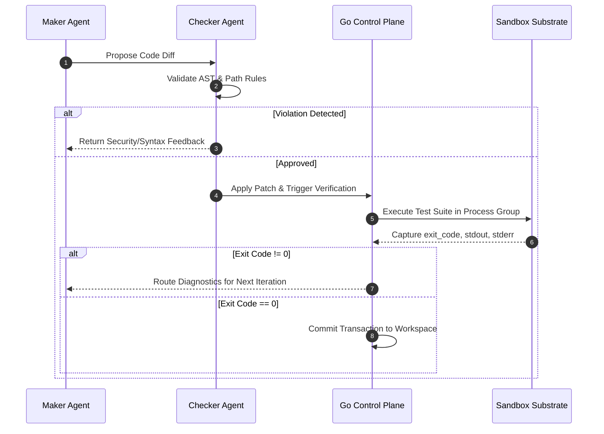

<div align="center">

# Loop Engine Core

### Deterministic TDD Harness & Sandboxed Execution Control Plane

[](https://github.com/Namanbhatt-01/loop-engine/actions/workflows/ci.yml)
[](https://github.com/Namanbhatt-01/loop-engine/releases)
[](https://golang.org)
[](https://python.org)
[](https://m8ven.ai/mcp/namanbhatt-01/loop-engine?s=readme)
[](https://opensource.org/licenses/MIT)
[](CONTRIBUTING.md)

<p align="center">
  <a href="#overview">Overview</a> •
  <a href="#architecture">Architecture</a> •
  <a href="#security-model">Security Model</a> •
  <a href="#universal-project-adapter">Universal Adapter</a> •
  <a href="#model-context-protocol-mcp-integration">MCP Server</a> •
  <a href="#quickstart">Quickstart</a> •
  <a href="#verification-topology-maker-vs-checker">Topology</a> •
  <a href="#contributing">Contributing</a>
</p>

</div>

---

## Overview

Autonomous code generators and agentic systems frequently encounter unbounded retries, hallucinations, memory exhaustion, and unvalidated modifications when left without deterministic constraints.

**Loop Engine Core** models automated development as a bounded control problem. It combines a high-performance **Go control plane and sandbox operator** with a **Python reasoning engine**, driving iterations through a strict **Reason -> Act -> Observe -> Evaluate -> Repeat** execution cycle.

Stopping conditions and patch validity are governed by **compiler diagnostics, process exit codes, POSIX kernel resource boundaries, and static AST security verification** rather than subjective model scoring.

---

## Architecture

```
               +-------------------------------------------------+
               |  Caller / Trigger (CLI, Webhook, MCP Client)    |
               +-------------------------------------------------+
                                       |
                                       v
+---------------------------------------------------------------------------------+
|                       GO CONTROL PLANE & SANDBOX OPERATOR                       |
|  - Deterministic FSM Engine                           - Process-Group Isolation |
|  - Bounded Output Buffers (2MB Anti-OOM)              - POSIX ulimit Governor   |
|  - Universal Stack Detector (Loopfile.yaml)           - Ephemeral Git Worktrees |
+---------------------------------------------------------------------------------+
                          |                         ^
        1. Spawn Engine   |                         | 4. Return Status
        (HTTP / IPC)      v                         | (Validated JSON)
+---------------------------------------------------------------------------------+
|                         PYTHON REASONING ENGINE                                 |
|  - AST Static Guardrail                               - Path Confinement Jail   |
|  - Maker Agent (Code Driver)                          - Checker Agent (Judge)   |
|  - Transactional Workspace Patcher                    - MCP Server Provider     |
+---------------------------------------------------------------------------------+
                          |                         ^
        2. Execute Tests  |                         | 3. Diagnostics
        (Kernel Sandbox)  v                         | (STDOUT / STDERR)
+---------------------------------------------------------------------------------+
|              SANDBOXED RUNTIME SUBSTRATE (ulimit & setpgid SIGKILL)             |
+---------------------------------------------------------------------------------+
```

---

## Security Model

Code execution and workspace modifications pass through a four-stage defense matrix:

```
+----------------------------------------------------------------------------------------+
| Layer 1: Static AST Guard                                                              |
|  * AST traversal blocks __subclasses__, __globals__, __builtins__, getattr             |
|  * Policy checks reject unauthorized imports (os, subprocess, pty, socket, ctypes)    |
+----------------------------------------------------------------------------------------+
| Layer 2: Path & Diff Jail Confinement                                                  |
|  * Canonical path resolution (os.path.commonpath) prevents workspace escapes           |
|  * Strict read-only locks protect sensitive assets (.env*, .git/**, secrets/**, *.pem) |
|  * Diff line limits restrict runaway rewrites per iteration                            |
+----------------------------------------------------------------------------------------+
| Layer 3: Kernel Sandbox Substrate                                                      |
|  * Process group isolation (Setpgid: true)                                             |
|  * Subtree termination via syscall.Kill(-pgid, SIGKILL) eliminates orphan processes    |
|  * POSIX ulimit boundaries constrain file descriptors and execution time               |
|  * Bounded 2MB stream buffers prevent memory exhaustion from verbose logging           |
+----------------------------------------------------------------------------------------+
| Layer 4: Deterministic Circuit Breakers                                                |
|  * Hard iteration limits prevent infinite cycles                                       |
|  * Cost and token ceilings restrict resource expenditure                               |
|  * Transactional patcher automatically rolls back files on convergence failure         |
+----------------------------------------------------------------------------------------+
```

---

## Universal Project Adapter (`Loopfile.yaml`)

Loop Engine Core is language-agnostic. It adapts to **C++, Go, Python, Rust, and TypeScript** repositories through a root configuration file or automatic stack detection:

```yaml
version: "1.0"
project:
  name: "dns-security-dataplane"
  language: "cpp" # auto | cpp | go | python | rust | typescript
  root: "."

limits:
  max_iterations: 3
  timeout_seconds: 30
  max_diff_lines: 200
  memory_limit_mb: 512
  cpu_cores: 2.0
  budget_limit_usd: 2.00

rules:
  protected_paths:
    - ".git/**"
    - ".env*"
    - "secrets/**"
  banned_imports:
    - "system"
    - "curl"

verification:
  build_command: "cmake -B build && cmake --build build"
  test_command: "ctest --test-dir build --output-on-failure"
  linter_command: "clang-tidy src/*.cpp"
```

---

## Verification Topology: Maker vs. Checker

To prevent confirmation bias, code generation is decoupled from validation:

* **Maker (Driver)**: Consumes requirements, current implementation context, and prior compiler diagnostics to formulate targeted diffs.
* **Checker (Judge)**: Validates diffs against AST security policies, path rules, and diff budgets before application.
* **Gatekeeper**: The Go sandbox executes the build and test commands in an isolated environment. Changes are committed only upon exit code `0`.



---

## Model Context Protocol (MCP) Integration

Loop Engine Core implements the **[Model Context Protocol (MCP)](https://modelcontextprotocol.io/)**, allowing external clients (Claude Desktop, Cursor, Cline, Goose) to invoke verification and sandbox capabilities via standard JSON-RPC.

### Available Tools

| Tool Name | Description | Parameters |
|:---|:---|:---|
| `run_verification` | Runs sandboxed build and TDD verification inside the Go control plane. | `task_id`, `project_root`, `test_command` |
| `read_workspace_file` | Safely reads workspace files with path confinement and protected path filters. | `relative_path`, `workspace_root` |
| `check_circuit_breaker` | Queries the control plane FSM for iteration boundary and budget limits. | `task_id`, `iteration`, `added_tokens`, `added_cost` |
| `verify_ast_guard` | Analyzes code statically to detect sandbox escapes and forbidden imports. | `proposed_code` |

### Resources and Prompts

* **Resources**:
  * `loop://config`: Reads the active `Loopfile.yaml` configuration.
  * `loop://health`: Returns the health and readiness status of the Go control plane daemon.
* **Prompts**:
  * `autonomous_tdd_cycle`: Provides standard Maker/Checker execution guidelines to host LLMs.

### Environment Variables

| Variable | Description | Default |
|:---|:---|:---|
| `LOOP_PORT` | Port for IPC between the Python MCP server and Go daemon. | `50051` |

### Client Configuration (`claude_desktop_config.json`)

To add Loop Engine to Claude Desktop or Cursor:

```json
{
  "mcpServers": {
    "loop-engine": {
      "command": "python3",
      "args": ["-m", "python_engine.mcp.mcp_server"],
      "env": {
        "LOOP_PORT": "50051"
      }
    }
  }
}
```

---

## Quickstart

### 1. Prerequisites
* **Go**: `1.22+`
* **Python**: `3.9+`
* *(Optional)* **Ollama**: running locally on `http://localhost:11434` for local execution.

### 2. Installation
```bash
git clone https://github.com/Namanbhatt-01/loop-engine.git
cd loop-engine
pip install -r requirements.txt
```

### 3. Launching
```bash
./scripts/run_loop.sh
```

---

## Test Suite

Automated test suites validate Go and Python substrates:

```bash
# Go control plane and sandbox tests
go test -v ./...

# Python AST guardrails, patcher, and MCP server tests
python3 -m unittest discover -s tests -v
```

---

## Repository Structure

```
loop-engine/
├── Loopfile.yaml                  # Project configuration
├── pyproject.toml                 # Python package definition & console scripts
├── cmd/
│   └── daemon/
│       └── main.go                # Go control plane HTTP/IPC daemon
├── pkg/
│   ├── config/                    # Loopfile parser & stack auto-detection
│   ├── sandbox/                   # Kernel sandbox, ulimit governor & worktrees
│   ├── state/                     # FSM state machine & circuit breakers
│   └── tdd/                       # Subprocess test runner with timeout control
├── python_engine/
│   ├── agents/
│   │   ├── maker.py               # Maker Agent (Driver)
│   │   └── checker.py             # Checker Agent (Judge)
│   ├── guardrails/
│   │   ├── ast_guard.py           # AST static analyzer & escape defenses
│   │   └── diff_limiter.py        # Path confinement & diff limiter
│   ├── llm/
│   │   └── client.py              # LLM client (Ollama / Gemini / Fallback)
│   ├── mcp/
│   │   └── mcp_server.py          # FastMCP server & JSON-RPC bridge
│   ├── patcher/
│   │   └── patcher.py             # Transactional workspace patcher
│   └── main.py                    # Autonomous loop driver
├── tests/                         # Unit tests
├── scripts/
│   └── run_loop.sh                # Build and run script
└── .github/workflows/ci.yml       # GitHub Actions CI workflow
```

---

## Contributing

Contributions are welcome. Please consult [CONTRIBUTING.md](CONTRIBUTING.md) and [CODE_OF_CONDUCT.md](CODE_OF_CONDUCT.md) before submitting pull requests.

---

## License

This project is licensed under the [MIT License](LICENSE). Copyright (c) 2026 Naman Bhatt.
