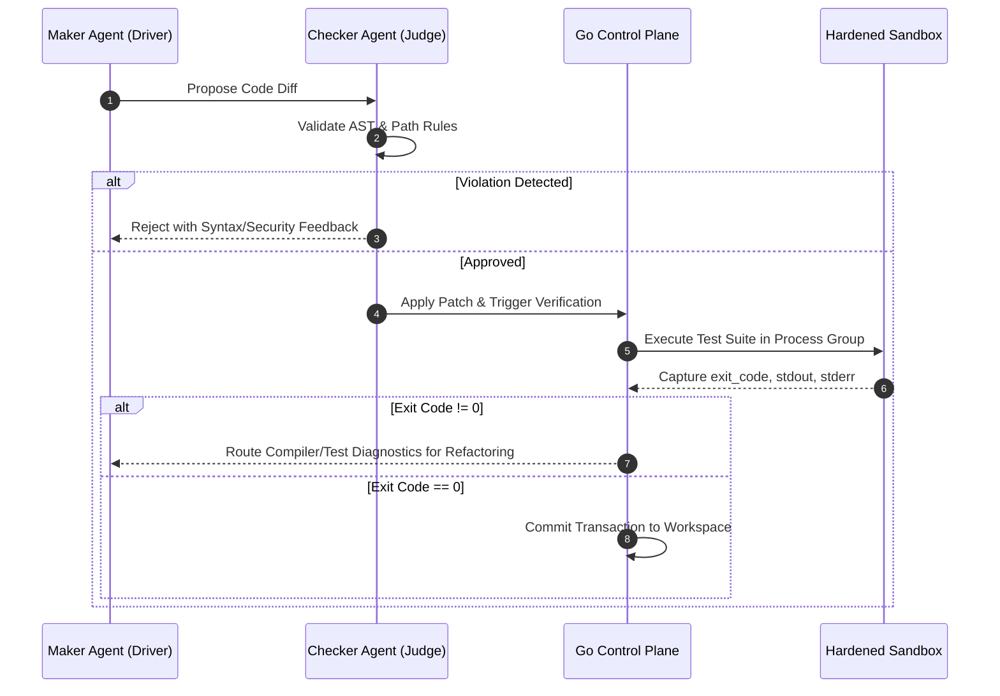

<div align="center">

# 🔁 Loop Engine Core

### **High-Performance Autonomous Loop Harness & Compiler-Driven TDD Control Plane**

[](https://github.com/Namanbhatt-01/loop-engine-core/actions/workflows/ci.yml)
[](https://github.com/Namanbhatt-01/loop-engine-core/releases)
[](https://golang.org)
[](https://python.org)
[](https://m8ven.ai/mcp/namanbhatt-01/loop-engine?s=readme)
[](https://opensource.org/licenses/MIT)
[](CONTRIBUTING.md)

<p align="center">
  <a href="#-architecture">Architecture</a> •
  <a href="#-the-4-layer-security-model">Security Model</a> •
  <a href="#-universal-project-adapter">Universal Adapter</a> •
  <a href="#-model-context-protocol-mcp-integration">MCP Server</a> •
  <a href="#-quickstart">Quickstart</a> •
  <a href="#-pair-programming-topology">Maker/Checker</a> •
  <a href="#-contributing">Contributing</a>
</p>

</div>

---

## 📌 Executive Summary

Modern AI coding agents fail when left unconstrained: they hallucinate APIs, leak host credentials, get stuck in infinite retry loops, and flood context windows with bloated logs. 

**Loop Engine Core** solves this by treating autonomous agent execution as a **deterministic, kernel-hardened control problem**. It pairs a high-performance **Go Control Plane & Sandbox Substrate** with an intelligent **Python Reasoning Engine**, driving iterative code generation through a strict **Reason → Act → Observe → Evaluate → Repeat** lifecycle.

Instead of soft "LLM-as-a-judge" self-grading, Loop Engine Core enforces **compiler diagnostics, exit codes, POSIX kernel resource boundaries, and static AST security verification** as physical stopping conditions.

---

## 🏛️ Architecture

```
               +-------------------------------------------------+
               |  USER / TRIGGER (Webhook, Issue, Slack, CLI)    |
               +-------------------------------------------------+
                                       |
                                       v
+---------------------------------------------------------------------------------+
|                       GO CONTROL PLANE & SANDBOX OPERATOR                       |
|  - Deterministic FSM Engine                           - Process-Group Isolation |
|  - Bounded Output Buffers (2MB Anti-OOM)              - POSIX ulimit Governor   |
|  - Universal Stack Detector (Loopfile.yaml)           - Ephemeral Git Worktrees |
+---------------------------------------------------------------------------------+
                          |                         ^
        1. Spawn Engine   |                         | 4. Return Status
        (HTTP / gRPC)     v                         | (Validated JSON)
+---------------------------------------------------------------------------------+
|                   PYTHON REASONING & PAIR-PROGRAMMING ENGINE                    |
|  - AST Static Guardrail (Escape Defeated)             - Path Confinement Jail   |
|  - Maker Agent (Code Driver)                          - Checker Agent (Judge)   |
|  - Transactional Workspace Patcher                    - Local Ollama & Frontier |
+---------------------------------------------------------------------------------+
                          |                         ^
        2. Execute Tests  |                         | 3. Diagnostics
        (Kernel Sandbox)  v                         | (STDOUT / STDERR)
+---------------------------------------------------------------------------------+
|              HARDENED RUNTIME SUBSTRATE (ulimit & setpgid SIGKILL)             |
+---------------------------------------------------------------------------------+
```

---

## 🛡️ The 4-Layer Security Model

Execution of generated code is gated through a multi-tiered defense matrix:

```
┌────────────────────────────────────────────────────────────────────────────────────────┐
│ Layer 1: Static AST Guard (Sandbox Escape Defeated)                                     │
│  • Deep AST traversal blocking __subclasses__, __globals__, __builtins__, getattr      │
│  • Whitelist/blacklist blocking unvetted imports (os, subprocess, pty, socket, ctypes) │
├────────────────────────────────────────────────────────────────────────────────────────┤
│ Layer 2: Path & Diff Jail Confinement (Traversal Defeated)                             │
│  • Canonical path resolution (os.path.commonpath) preventing ../../ workspace escapes  │
│  • Strict read-only locks on protected assets (.env*, .git/**, secrets/**, *.pem)      │
│  • Max diff line limit (e.g. 250 lines/iteration) preventing massive runaway rewrites  │
├────────────────────────────────────────────────────────────────────────────────────────┤
│ Layer 3: Kernel Sandbox Substrate (Resource & Process Tree Hardening)                  │
│  • Setpgid: true runs commands in dedicated OS process groups                          │
│  • Subtree termination via syscall.Kill(-pgid, SIGKILL) eliminating orphan leaks       │
│  • POSIX ulimit boundaries (ulimit -n 1024, ulimit -t <timeout>)                      │
│  • Bounded 2MB stream buffers preventing Host OOM memory exhaustion attacks            │
├────────────────────────────────────────────────────────────────────────────────────────┤
│ Layer 4: Deterministic Circuit Breakers & Token Budget                                 │
│  • Hard iteration cap (default: 3 max) preventing infinite retry loops                 │
│  • Real-time dollar and token budget exhaustion ceilings                               │
│  • Transactional Workspace Patcher automatically reverts files on convergence failure  │
└────────────────────────────────────────────────────────────────────────────────────────┘
```

---

## ⚙️ Universal Project Adapter (`Loopfile.yaml`)

Loop Engine Core is **polyglot and stack-agnostic**. It attaches cleanly to **C++, Go, Python, Rust, and TypeScript** codebases.

Drop a `Loopfile.yaml` into your repository root (or let the engine auto-detect your stack):

```yaml
version: "1.0"
project:
  name: "dns-security-dataplane"
  language: "cpp" # auto | cpp | go | python | rust | typescript
  root: "."

limits:
  max_iterations: 3
  timeout_seconds: 30
  max_diff_lines: 200
  memory_limit_mb: 512
  cpu_cores: 2.0
  budget_limit_usd: 2.00

rules:
  protected_paths:
    - ".git/**"
    - ".env*"
    - "secrets/**"
  banned_imports:
    - "system"
    - "curl"

verification:
  build_command: "cmake -B build && cmake --build build"
  test_command: "ctest --test-dir build --output-on-failure"
  linter_command: "clang-tidy src/*.cpp"
```

---

## 👥 Pair Programming Topology: Maker vs. Checker

To prevent confirmation bias, generation is strictly separated from evaluation:

* **The Maker (Driver)**: Reads issue requirements, existing file context, and prior compiler diagnostics. Formulates minimal, surgical code diffs.
* **The Checker (Judge & Navigator)**: Evaluates proposed diffs against AST security policies, path jail rules, and style constraints.
* **The Scorekeeper Gate**: The Go substrate runs the sandboxed build & test command. Only when exit code is `0` does the engine commit the changes.



---

## 🚀 Quickstart

### 1. Prerequisites
- **Go**: `1.22+`
- **Python**: `3.9+`
- *(Optional)* **Ollama**: running locally on `http://localhost:11434` for 100% offline, zero-data-leak execution.

### 2. Installation
```bash
git clone https://github.com/Namanbhatt-01/loop-engine-core.git
cd loop-engine-core
pip install -r requirements.txt
```

### 3. Launching the Autonomous Loop
```bash
./scripts/run_loop.sh
```

---

## 🔌 Model Context Protocol (MCP) Integration

Loop Engine Core natively implements the **[Model Context Protocol (MCP)](https://modelcontextprotocol.io/)**, allowing external frontier models and agentic harnesses (Claude Desktop, Cursor, Cline, Goose) to safely invoke deterministic verification and sandboxed execution as standard MCP tools.

### Available MCP Tools

| Tool Name | Description | Key Arguments |
|:---|:---|:---|
| `run_verification` | Triggers sandboxed TDD execution inside the Go Control Plane with process group isolation. | `task_id`, `project_root`, `test_command` |
| `read_workspace_file` | Safely reads workspace file contents enforced by path jail confinement and protected asset filters. | `relative_path`, `workspace_root` |
| `check_circuit_breaker` | Queries the Go daemon FSM for iteration boundary caps and dollar/token budget ceilings. | `task_id`, `iteration`, `added_tokens`, `added_cost` |
| `verify_ast_guard` | Statically analyzes proposed Python code to defeat sandbox escapes (`__subclasses__`, eval, unauthorized imports). | `proposed_code` |

### Environment Variables

| Variable | Description | Default |
|:---|:---|:---|
| `LOOP_PORT` | Port for communication between the Python MCP server bridge and the Go Control Plane daemon. | `50051` |

### Client Configuration (`claude_desktop_config.json`)

To register Loop Engine in Claude Desktop or Cursor, add the following to your configuration file:

```json
{
  "mcpServers": {
    "loop-engine": {
      "command": "python3",
      "args": ["-m", "python_engine.mcp.mcp_server"],
      "env": {
        "LOOP_PORT": "50051"
      }
    }
  }
}
```

---

## 🧪 Comprehensive Test Suite

Loop Engine Core features 100% automated test coverage across both Go and Python substrates:

```bash
# Run Go Control Plane & Sandbox test suite
go test -v ./...

# Run Python Guardrails, AST, and Transactional Patcher tests
python3 -m unittest discover -s tests -v
```

---

## 📂 Repository Structure

```
loop-engine-core/
├── Loopfile.yaml                  # Universal project configuration
├── cmd/
│   └── daemon/
│       └── main.go                # Go Control Plane HTTP/IPC Daemon
├── pkg/
│   ├── config/                    # Loopfile parser & stack auto-detection
│   ├── sandbox/                   # Kernel sandbox, ulimit governor & worktree
│   ├── state/                     # Formal FSM state machine & circuit breakers
│   └── tdd/                       # Subprocess test runner with timeout controls
├── python_engine/
│   ├── agents/
│   │   ├── maker.py               # Maker Agent (Driver / Code Author)
│   │   └── checker.py             # Checker Agent (Judge / Scorekeeper)
│   ├── guardrails/
│   │   ├── ast_guard.py           # AST static analyzer & escape defense
│   │   └── diff_limiter.py        # Path jail confinement & diff limiter
│   ├── llm/
│   │   └── client.py              # Multi-provider client (Ollama / Gemini / Fallback)
│   ├── patcher/
│   │   └── patcher.py             # Transactional patcher with snapshot rollback
│   └── main.py                    # Autonomous loop driver
├── tests/                         # End-to-end Python test suites
├── scripts/
│   └── run_loop.sh                # End-to-end automated launcher
├── SKILL.md                       # Persistent agent skill guidelines
└── .github/workflows/ci.yml       # GitHub Actions CI workflow
```

---

## 🤝 Contributing

Contributions are welcome! Please read [CONTRIBUTING.md](CONTRIBUTING.md) and our [CODE_OF_CONDUCT.md](CODE_OF_CONDUCT.md) before opening a pull request.

---

## 📄 License

This project is licensed under the [MIT License](LICENSE). Copyright © 2026 Naman Bhatt.
